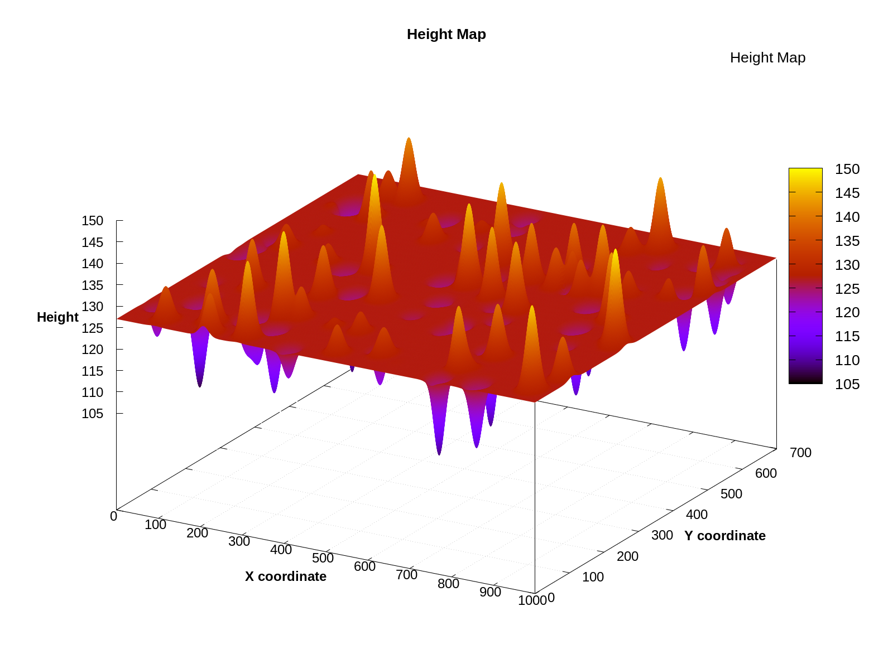
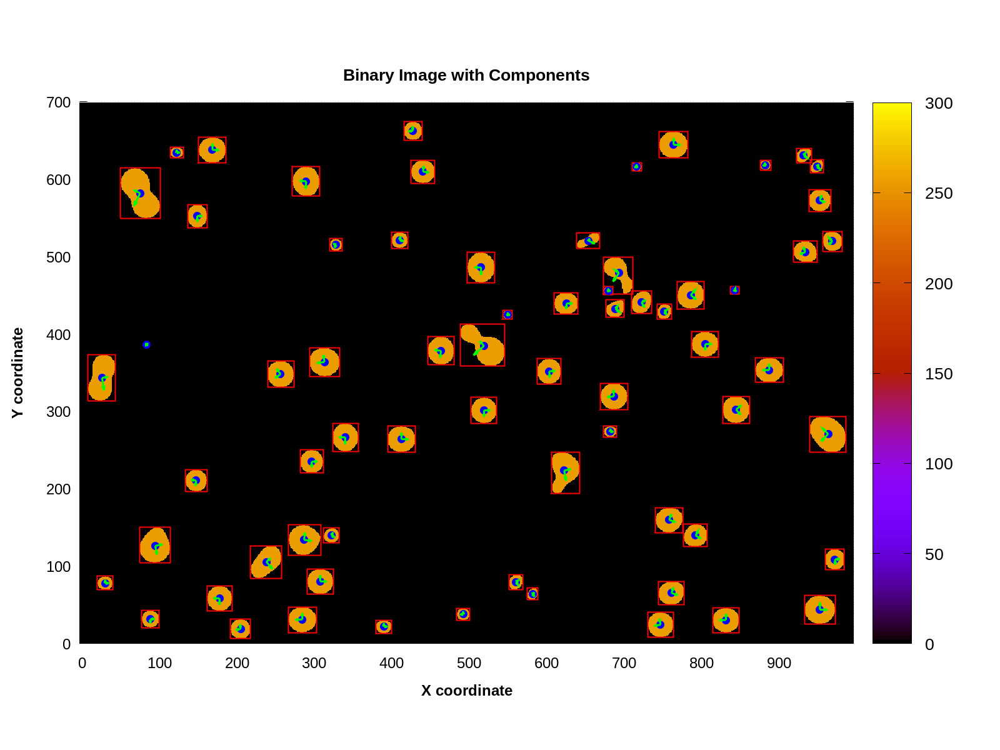
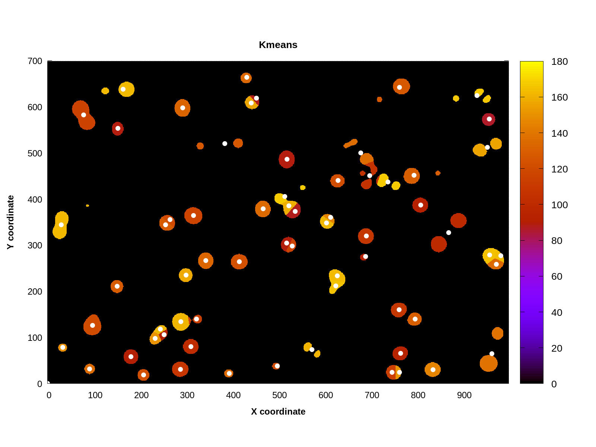
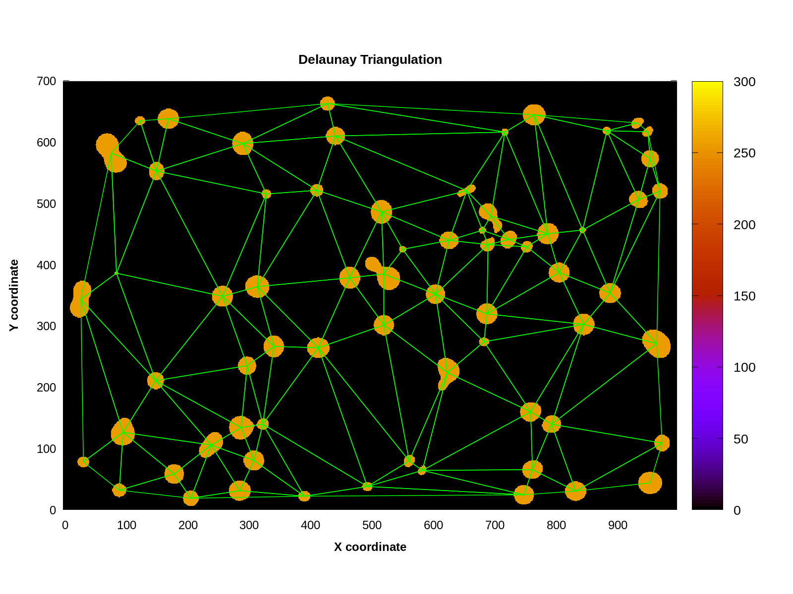
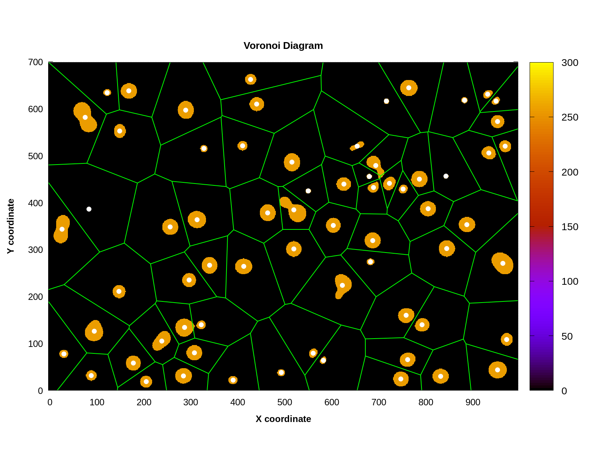
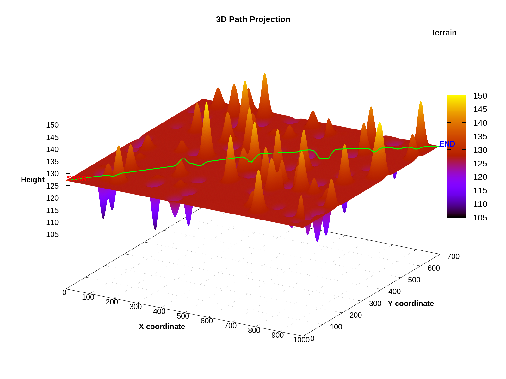
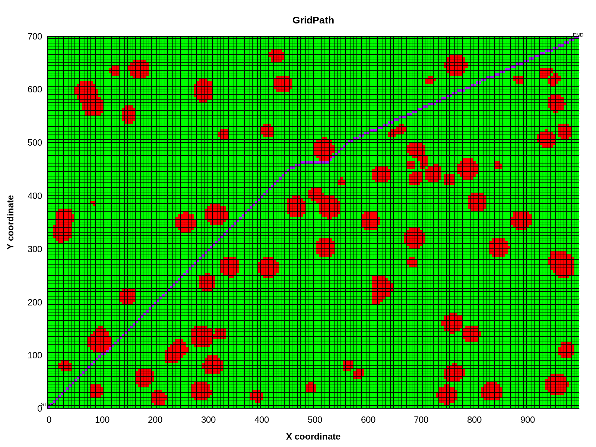
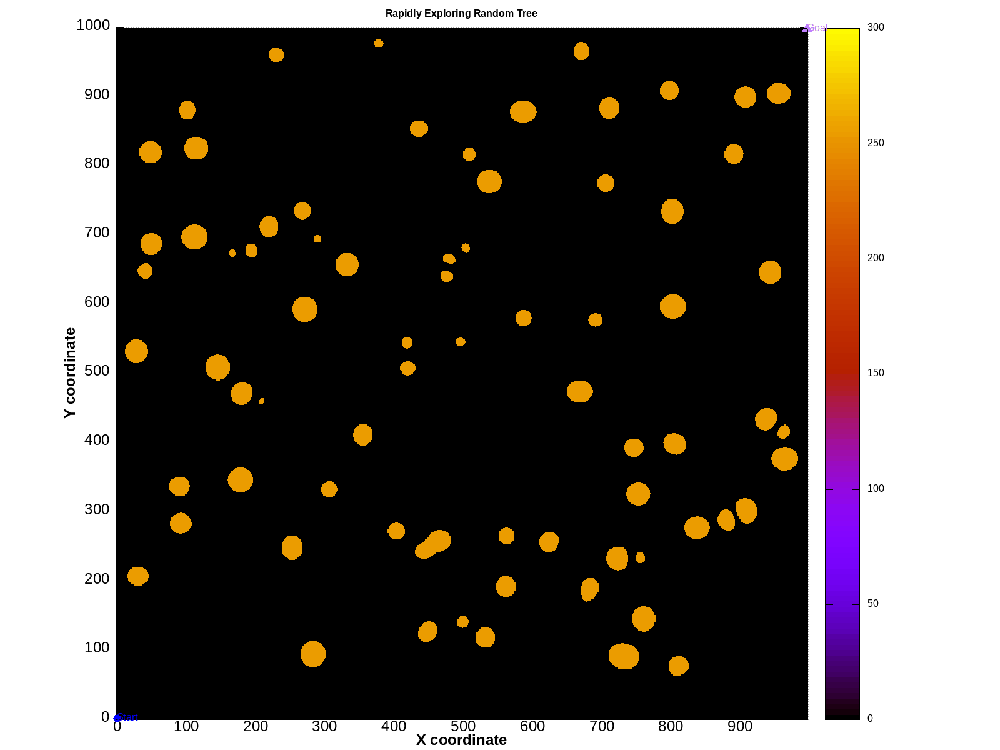
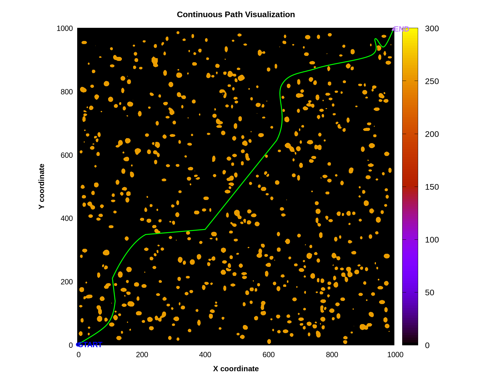

# Terrain Navigation System

Программа для анализа рельефа местности, построения триангуляции Делоне, диаграмм Вороного и поиска оптимальных маршрутов с учетом препятствий.

## 🧭 Pipeline обработки данных
- Генерация/загрузка карты высот (формат BMP и GNUPLOT)

- Бинаризация и компоненты

- Кластеризация объектов методом k-means

- Триангуляция Делоне с учетом высот

- Построение диаграммы Вороного

- Навигационный граф, построенный по диаграмме Вороного с ограничениями по углу наклона тележки и ее радиуса

- Поиск пути на графе

- Поиск пути на сетке

- RRT

- RRT* три картинки

- Shortcut + кубический сплайн на RRT

## 📚 Документация
- 📘 [User Guide](docs/UserGuide.md) — описание всех команд и сценариев использования  
- 🛠 [Developer Guide](docs/DeveloperGuide.md) — архитектура и расширение системы
- 🚧 [WIP / Research Notes](docs/WIP.md) — текущие задачи, исследовательские направления и последние изменения проекта

## 📊 Исследования
- [Graph — Graph-based Path Planning](notebooks/graph.ipynb) — сравнение алгоритмов A*, Dijkstra и Greedy на навигационном графе, построеным на основе диаграммы Вороного
- [Grid — Grid-based Path Planning](notebooks/grid.ipynb) — сравнение алгоритмов A*, Dijkstra и Greedy на сетке
- [Sampling — Sampling-based Path Planning](notebooks/rrt.ipynb) — сравнение алгоритмов RRT и RRT*
- [Comparison — Path Planning Environments](notebooks/pathCommands.ipynb) — сравнение Graph, Grid, RRT и RRT*

## 📄 Лицензия
Этот проект лицензирован под MIT License. Вы можете свободно использовать, изменять и распространять код, при условии, что вы укажете автора.

Разрешенные действия:

   1. Использование кода в коммерческих и некоммерческих проектах
   2. Модификация кода
   3. Распространение кода

Обязательное условие: при использовании кода, пожалуйста, укажите ссылку на автора.

Developed with ❤️ by **DebugDestroy**  
[GitHub Profile](https://github.com/DebugDestroy)
